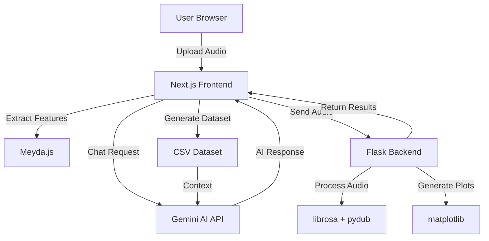

# 🎵 AudioSense

<div align="center">


**Intelligent Audio Analysis & Enhancement Platform**

A rapid prototyping tool for music producers, audio engineers, and sound designers to analyze, visualize, and modify audio with AI-powered assistance.

[](https://nextjs.org/)
[](https://www.python.org/)
[](https://flask.palletsprojects.com/)
[](https://www.typescriptlang.org/)

[Features](#-features) • [Installation](#-installation) • [Usage](#-usage) • [Architecture](#-architecture) • [API Reference](#-api-reference)

</div>

---

## 📖 Table of Contents

- [Overview](#-overview)
- [Key Features](#-key-features)
- [Technology Stack](#-technology-stack)
- [Installation](#-installation)
- [Usage Guide](#-usage-guide)
- [Architecture](#-architecture)
- [Audio Analysis Pipeline](#-audio-analysis-pipeline)
- [AI Assistant](#-ai-assistant)
- [API Reference](#-api-reference)
- [Configuration](#-configuration)
- [Troubleshooting](#-troubleshooting)
- [Contributing](#-contributing)
- [License](#-license)

---

## 🎯 Overview

**AudioSense** is a cutting-edge audio prototyping platform designed for professionals who need to quickly test, analyze, and modify audio files. Built with modern web technologies and powered by AI, AudioSense bridges the gap between complex audio engineering and intuitive user experience.

### 🎭 What Makes AudioSense Special?

- **🚀 Rapid Prototyping**: Test audio modifications in seconds, not minutes
- **🤖 AI-Powered Insights**: Gemini AI analyzes your audio and suggests intelligent modifications
- **📊 Deep Analysis**: Extract 20+ audio features including MFCCs, spectral characteristics, and dynamics
- **🎨 Beautiful Visualizations**: Real-time waveforms, spectrograms, and spectrum analysis
- **💬 Conversational Interface**: Ask questions about your audio in natural language
- **🎛️ Manual Controls**: Fine-tune loudness, bass, treble, pitch, and time ranges
- **📈 Dataset-Driven**: All modifications are based on scientifically extracted audio datasets

---

## ✨ Key Features

### 🔬 Advanced Audio Analysis

AudioSense performs comprehensive audio analysis using the **Meyda** audio feature extraction library and custom Python processing:

| Feature Category | Metrics Extracted |
|-----------------|-------------------|
| **Loudness & Dynamics** | RMS Energy, Peak RMS, Dynamic Range (dB), Signal-to-Noise Ratio |
| **Frequency Analysis** | Spectral Centroid, Spectral Bandwidth, Spectral Rolloff, Frequency Balance |
| **Tonal Content** | Zero Crossing Rate (ZCR), Pitch Estimation, ZCR Stability |
| **Timbre** | 13 MFCC Coefficients, Timbre Character Classification |
| **Quality Metrics** | Noise Floor, Recording Quality Score, Clarity Index, Fidelity Rating |

### 🎨 Visual Analytics

- **Waveform Display**: Interactive waveform with time-domain visualization
- **Spectrogram**: Frequency-time representation showing spectral evolution
- **Spectrum Analysis**: Real-time frequency spectrum with AI-generated insights
- **Custom Audio Player**: SoundCloud-style player with waveform scrubbing

### 🤖 AI Assistant (Gemini-Powered)

The AI assistant understands your audio and can:

- **Explain Measurements**: "What does spectral centroid mean for my track?"
- **Classify Content**: Automatically detect audio character (Bright, Dark, Balanced, etc.)
- **Detect Issues**: Identify distortion, noise, clipping, and quality problems
- **Suggest Modifications**: "Make it warmer", "Increase brightness", "Boost bass"
- **Apply Changes**: Automatically calculate and apply audio modifications

### 🎛️ Audio Modification Engine

**Manual Controls:**
- **Loudness**: -20dB to +20dB adjustment
- **Bass**: -12dB to +12dB (low-frequency boost/cut)
- **Treble**: -12dB to +12dB (high-frequency boost/cut)
- **Pitch**: -12 to +12 semitones (one octave range)
- **Time Range**: Select specific portions of audio to process

**AI-Driven Modifications:**
- Natural language requests processed by Gemini AI
- Intelligent parameter calculation based on audio analysis
- Context-aware suggestions using the full audio dataset

---

## 🛠️ Technology Stack

### Frontend

```
Next.js 16.0.3 (Turbopack)
├── React 18
├── TypeScript 5.0+
├── Meyda (Audio Feature Extraction)
├── Web Audio API
└── Custom CSS (Glassmorphism Design)
```

### Backend

```
Python 3.8+
├── Flask 3.0+ (REST API)
├── librosa (Audio Processing)
├── matplotlib (Visualization Generation)
├── numpy (Numerical Computing)
├── soundfile (Audio I/O)
└── pydub (Audio Manipulation)
```

### AI Integration

```
Google Gemini AI
├── gemini-1.5-flash (Chat & Analysis)
├── Context-Aware Responses
└── Audio Dataset Integration
```

---

## 📦 Installation

### Prerequisites

Ensure you have the following installed:

- **Node.js** 18.x or higher
- **Python** 3.8 or higher
- **npm** or **yarn**
- **pip** (Python package manager)

### Step 1: Clone the Repository

```bash
git clone https://github.com/yourusername/audiosense.git
cd audiosense
```

### Step 2: Install Frontend Dependencies

```bash
npm install
# or
yarn install
```

### Step 3: Install Python Dependencies

```bash
cd python_backend
pip install -r requirements.txt
```

**Required Python Packages:**
```txt
flask==3.0.0
flask-cors==4.0.0
librosa==0.10.1
matplotlib==3.8.0
numpy==1.24.3
soundfile==0.12.1
pydub==0.25.1
google-generativeai==0.3.0
```

### Step 4: Configure Environment Variables

Create a `.env.local` file in the root directory:

```env
# Gemini AI API Key
GEMINI_API_KEY=your_gemini_api_key_here

# Optional: Custom Configuration
NEXT_PUBLIC_API_URL=http://localhost:5001
```

**Get your Gemini API Key:**
1. Visit [Google AI Studio](https://makersuite.google.com/app/apikey)
2. Create a new API key
3. Copy and paste it into `.env.local`

### Step 5: Start the Development Servers

**Terminal 1 - Frontend (Next.js):**
```bash
npm run dev
```

**Terminal 2 - Backend (Python/Flask):**
```bash
cd python_backend
python server.py
```

The application will be available at:
- **Frontend**: http://localhost:3000
- **Backend API**: http://localhost:5001

---

## 🎯 Usage Guide

### 1️⃣ Upload Audio

1. Click **"Browse Files"** or drag and drop an audio file
2. Supported formats: `.mp3`, `.wav`, `.aiff`, `.flac`, `.ogg`
3. Maximum file size: 50MB (recommended)

### 2️⃣ Analyze Audio

1. Click **"Analyze Audio"** button
2. Wait for the analysis to complete (5-15 seconds depending on file size)
3. View the comprehensive analysis results:
   - **Character**: Audio tonal character (Bright, Dark, Neutral, etc.)
   - **Dynamics Score**: Loudness and dynamic range rating (0-100)
   - **Brightness Score**: Frequency balance rating (0-100)
   - **Duration**: Total audio length
   - **Tempo**: Estimated BPM (placeholder for now)

### 3️⃣ Explore Visualizations

After analysis, scroll down to view:

- **Waveform**: Time-domain amplitude visualization
- **Spectrogram**: Frequency-time heatmap
- **Spectrum**: Frequency distribution graph

Each visualization includes AI-generated insights explaining what the graph reveals about your audio.

### 4️⃣ Modify Audio

**Option A: Manual Controls**

1. Adjust sliders for:
   - **Loudness**: Overall volume adjustment
   - **Bass**: Low-frequency content
   - **Treble**: High-frequency content
   - **Pitch**: Semitone shifting
   - **Time Range**: Select portion to process
2. Click **"Preview"** to hear a sample
3. Click **"Apply Changes"** to process the full audio
4. Click **"Download"** to save the modified file

**Option B: AI Assistant**

1. Type natural language requests in the chat:
   - "Make it brighter"
   - "Increase bass and reduce treble"
   - "Boost the pitch by 5 semitones"
   - "What's the signal-to-noise ratio?"
2. The AI will either:
   - **Answer your question** with detailed analysis
   - **Apply modifications** automatically
3. Download the modified audio from the chat player

### 5️⃣ Download Results

- **Modified Audio**: Click "Download Audio" (WAV format)
- **Analysis Dataset**: Click "Download Dataset" (CSV format)

The CSV dataset contains frame-by-frame analysis with 20+ features per frame, perfect for further processing or machine learning applications.

---

## 🏗️ Architecture

### System Overview



### Frontend Architecture

```
app/
├── page.tsx                 # Main application component
├── layout.tsx              # Root layout with metadata
├── globals.css             # Global styles (glassmorphism theme)
├── components/
│   ├── Loader.tsx          # Loading animation component
│   ├── AudioVisualizations.tsx  # Visualization display
│   └── AudioControls.tsx   # Manual control sliders
└── api/
    └── gemini/
        └── route.ts        # Gemini AI API route
```

### Backend Architecture

```
python_backend/
├── server.py               # Flask server (port 5001)
├── analyze_audio.py        # Audio analysis & visualization
├── process_audio.py        # Audio modification engine
└── requirements.txt        # Python dependencies
```

---

## 🔬 Audio Analysis Pipeline

### Phase 1: Client-Side Feature Extraction

**Technology**: Meyda.js + Web Audio API

```javascript
// Extract features every 0.5 seconds
const features = Meyda.extract([
  "rms",                  // Root Mean Square (loudness)
  "zcr",                  // Zero Crossing Rate (pitch)
  "spectralCentroid",     // Frequency balance
  "spectralSpread",       // Frequency distribution
  "spectralRolloff",      // High-frequency cutoff
  "mfcc"                  // Mel-Frequency Cepstral Coefficients (timbre)
]);
```

**Output**: CSV dataset with columns:
```
duration_sec, rms_energy, zcr, spectral_centroid, spectral_bandwidth, 
spectral_rolloff, tempo, mfcc_1, mfcc_2, ..., mfcc_13
```

### Phase 2: Statistical Analysis

**Metrics Calculated**:

| Metric | Formula | Purpose |
|--------|---------|---------|
| **Dynamic Range** | `20 * log10(peak_rms / min_rms)` | Measure loudness variation |
| **SNR** | `20 * log10(avg_rms / noise_floor)` | Signal quality assessment |
| **Brightness** | Based on spectral centroid | Frequency balance (0-100) |
| **Dynamics Score** | Based on RMS values | Energy level (0-100) |

### Phase 3: Character Classification

```javascript
if (avgCentroid > 3000) {
  character = "Bright & Airy"
  brightnessScore = 85
} else if (avgCentroid < 1000) {
  character = "Dark & Warm"
  brightnessScore = 25
} else {
  character = "Neutral & Clear"
  brightnessScore = 50
}
```

### Phase 4: Backend Visualization

**Python Processing** (analyze_audio.py):

1. **Load Audio**: `librosa.load(audio_path)`
2. **Generate Waveform**: Time-domain amplitude plot
3. **Generate Spectrogram**: Short-Time Fourier Transform (STFT)
4. **Generate Spectrum**: FFT frequency analysis
5. **AI Insights**: Gemini analyzes each visualization
6. **Encode Images**: Base64 encoding for transmission

---

## 🤖 AI Assistant

### How It Works

The AI assistant uses **Google Gemini 1.5 Flash** with a sophisticated context system:

```typescript
const context = `
Audio Analysis Report:

BASIC CHARACTERISTICS:
- Character: ${insights.character}
- Duration: ${insights.duration}
- Sample Rate: ${sampleRate} Hz

LOUDNESS & DYNAMICS:
- Average RMS: ${avgRms}
- Dynamic Range: ${dynamicRange} dB
- SNR: ${snr} dB

FREQUENCY ANALYSIS:
- Spectral Centroid: ${centroid} Hz
- Brightness Score: ${brightnessScore}/100
...
`;
```

### Conversation Modes

**1. Question Mode** (Analysis & Explanation)

User: *"What's the signal-to-noise ratio?"*

AI Response:
```
Your audio has a signal-to-noise ratio of 42.3 dB, which indicates 
a very clean recording. This means the actual audio signal is 42.3 dB 
louder than the background noise floor...
```

**2. Modification Mode** (Audio Processing)

User: *"Make it brighter and boost the bass"*

AI Response:
```json
{
  "type": "modification",
  "message": "I'll increase the treble for brightness and boost the bass...",
  "params": {
    "loudness": 0,
    "bass": 6,
    "treble": 8,
    "pitch": 0
  }
}
```

The frontend automatically applies these parameters and processes the audio.

### Smart Suggestions

Based on audio character, the AI generates contextual suggestions:

```javascript
if (character === "Bright & Airy") {
  suggestions = [
    "Tame harsh high frequencies",
    "Boost low-mid warmth",
    "Compress to glue the mix"
  ]
}
```

---

## 📡 API Reference

### Frontend API Routes

#### `POST /api/gemini`

**Gemini AI Chat Endpoint**

**Request Body:**
```json
{
  "mode": "chat",
  "messages": [
    { "role": "user", "text": "What's the frequency balance?" }
  ],
  "context": "Audio Analysis Report: ..."
}
```

**Response (Question Mode):**
```json
{
  "type": "question",
  "text": "Your audio has a balanced frequency response..."
}
```

**Response (Modification Mode):**
```json
{
  "type": "modification",
  "message": "I'll boost the bass...",
  "params": {
    "loudness": 0,
    "bass": 6,
    "treble": 0,
    "pitch": 0
  }
}
```

---

### Backend API Routes

#### `POST /api/visualize`

**Generate Audio Visualizations**

**Request:**
- **Content-Type**: `multipart/form-data`
- **Body**: `audio` (file)

**Response:**
```json
{
  "success": true,
  "visualizations": {
    "waveform": {
      "image": "data:image/png;base64,...",
      "insight": "AI-generated waveform analysis",
      "metrics": { ... }
    },
    "spectrogram": { ... },
    "spectrum": { ... }
  }
}
```

#### `POST /api/process-audio`

**Apply Audio Modifications**

**Request:**
- **Content-Type**: `multipart/form-data`
- **Body**: 
  - `audio` (file)
  - `params` (JSON string)

**Params Format:**
```json
{
  "loudness": 3,      // -20 to +20 dB
  "bass": 6,          // -12 to +12 dB
  "treble": -3,       // -12 to +12 dB
  "pitch": 2,         // -12 to +12 semitones
  "timeRange": [0, 100],  // Start/end in seconds
  "preview": false    // true for preview, false for full
}
```

**Response:**
- **Content-Type**: `audio/wav`
- **Body**: Processed audio file (binary)

#### `GET /health`

**Health Check**

**Response:**
```json
{
  "status": "healthy",
  "service": "audio-visualization"
}
```

---

## ⚙️ Configuration

### Frontend Configuration

**next.config.js:**
```javascript
/** @type {import('next').NextConfig} */
const nextConfig = {
  reactStrictMode: true,
  swcMinify: true,
}

module.exports = nextConfig
```

### Backend Configuration

**server.py:**
```python
# Server Configuration
HOST = '0.0.0.0'
PORT = 5001
DEBUG = True
USE_RELOADER = False  # Important: prevents matplotlib crashes

# CORS Configuration
CORS(app, resources={
    r"/*": {
        "origins": "*",
        "methods": ["GET", "POST", "OPTIONS"],
        "allow_headers": "*"
    }
})
```

### Audio Processing Parameters

**Default Settings** (process_audio.py):
```python
# Equalization
BASS_FREQ = 200      # Hz
TREBLE_FREQ = 8000   # Hz
Q_FACTOR = 0.707     # Butterworth filter

# Pitch Shifting
PITCH_STEPS = 2048   # FFT window size

# Time Range
SAMPLE_RATE = 44100  # Hz (standard CD quality)
```

---

## 🐛 Troubleshooting

### Common Issues

#### 1. **"Failed to fetch" Error**

**Cause**: Backend not running or port mismatch

**Solution**:
```bash
# Check if backend is running on port 5001
cd python_backend
python server.py

# Verify in page.tsx that fetch URLs use port 5001
fetch('http://localhost:5001/api/visualize', ...)
```

#### 2. **Gemini API Errors**

**Cause**: Invalid or missing API key

**Solution**:
```bash
# Check .env.local file
cat .env.local

# Ensure GEMINI_API_KEY is set
GEMINI_API_KEY=your_actual_key_here

# Restart Next.js dev server
npm run dev
```

#### 3. **Python Module Not Found**

**Cause**: Missing dependencies

**Solution**:
```bash
cd python_backend
pip install -r requirements.txt

# If issues persist, try upgrading pip
pip install --upgrade pip
pip install -r requirements.txt --force-reinstall
```

#### 4. **Audio Player Not Working**

**Cause**: Browser autoplay restrictions

**Solution**:
- Click the play button manually
- Check browser console for errors
- Ensure audio file is valid WAV format

#### 5. **Visualizations Not Generating**

**Cause**: matplotlib backend issues

**Solution**:
```python
# In analyze_audio.py, ensure:
import matplotlib
matplotlib.use('Agg')  # Non-interactive backend
```

---

## 🎨 Design System

### Color Palette

```css
/* Dark Theme (Default) */
--background: #04070f;
--foreground: #f5f8ff;
--accent: #6c8bff;
--accent-soft: rgba(108, 139, 255, 0.18);

/* Light Theme */
--background: #f5f8ff;
--foreground: #0a0f1c;
--accent: #5370e4;
```

### Typography

- **Primary Font**: Plus Jakarta Sans
- **Monospace**: Courier New (for code/metrics)
- **Sizes**: Fluid scaling with `clamp()`

### Components

- **Glassmorphism**: `backdrop-filter: blur(22px)`
- **Border Radius**: 12px (small), 18px (medium), 28px (large)
- **Animations**: Smooth 0.2s-0.3s transitions

---

## 🚀 Performance Optimization

### Frontend Optimizations

- **Code Splitting**: Next.js automatic code splitting
- **Image Optimization**: Base64 inline for visualizations
- **Lazy Loading**: Components loaded on-demand
- **Memoization**: React.memo for expensive components

### Backend Optimizations

- **Streaming**: Large audio files processed in chunks
- **Caching**: Matplotlib figure caching
- **Async Processing**: Non-blocking audio operations
- **Resource Cleanup**: Automatic temp file deletion

---

## 📊 Dataset Format

### CSV Structure

```csv
duration_sec,rms_energy,zcr,spectral_centroid,spectral_bandwidth,spectral_rolloff,tempo,mfcc_1,mfcc_2,...,mfcc_13
0.00,0.0234,0.0456,1234.56,789.01,2345.67,120,-15.23,8.45,...,2.34
0.50,0.0245,0.0467,1245.67,790.12,2356.78,120,-15.34,8.56,...,2.45
...
```

### Feature Descriptions

| Feature | Unit | Description |
|---------|------|-------------|
| `duration_sec` | seconds | Time offset from start |
| `rms_energy` | amplitude | Root Mean Square energy (loudness) |
| `zcr` | rate | Zero crossing rate (pitch indicator) |
| `spectral_centroid` | Hz | Center of mass of spectrum |
| `spectral_bandwidth` | Hz | Spread of spectrum |
| `spectral_rolloff` | Hz | Frequency below which 85% of energy exists |
| `tempo` | BPM | Estimated beats per minute |
| `mfcc_1` to `mfcc_13` | - | Mel-Frequency Cepstral Coefficients (timbre) |

---

## 🤝 Contributing

We welcome contributions! Here's how you can help:

### Development Setup

1. Fork the repository
2. Create a feature branch: `git checkout -b feature/amazing-feature`
3. Make your changes
4. Run tests (if applicable)
5. Commit: `git commit -m 'Add amazing feature'`
6. Push: `git push origin feature/amazing-feature`
7. Open a Pull Request

### Code Style

- **Frontend**: Follow TypeScript/React best practices
- **Backend**: Follow PEP 8 Python style guide
- **Commits**: Use conventional commits format

---

## 📄 License

This project is licensed under the **MIT License**.

```
MIT License

Copyright (c) 2025 AudioSense

Permission is hereby granted, free of charge, to any person obtaining a copy
of this software and associated documentation files (the "Software"), to deal
in the Software without restriction...
```

---

## 🙏 Acknowledgments

- **Meyda.js** - Audio feature extraction library
- **librosa** - Python audio analysis library
- **Google Gemini** - AI-powered insights
- **Next.js** - React framework
- **Flask** - Python web framework

---

## 📞 Support

- **Issues**: [GitHub Issues](https://github.com/yourusername/audiosense/issues)
- **Discussions**: [GitHub Discussions](https://github.com/yourusername/audiosense/discussions)
- **Email**: support@audiosense.dev

---

<div align="center">

**Made with ❤️ by the AudioSense Team**

[⬆ Back to Top](#-audiosense)

</div>
